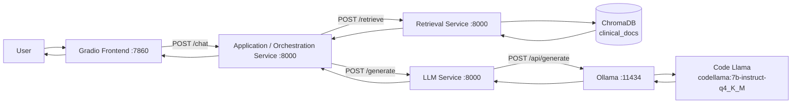
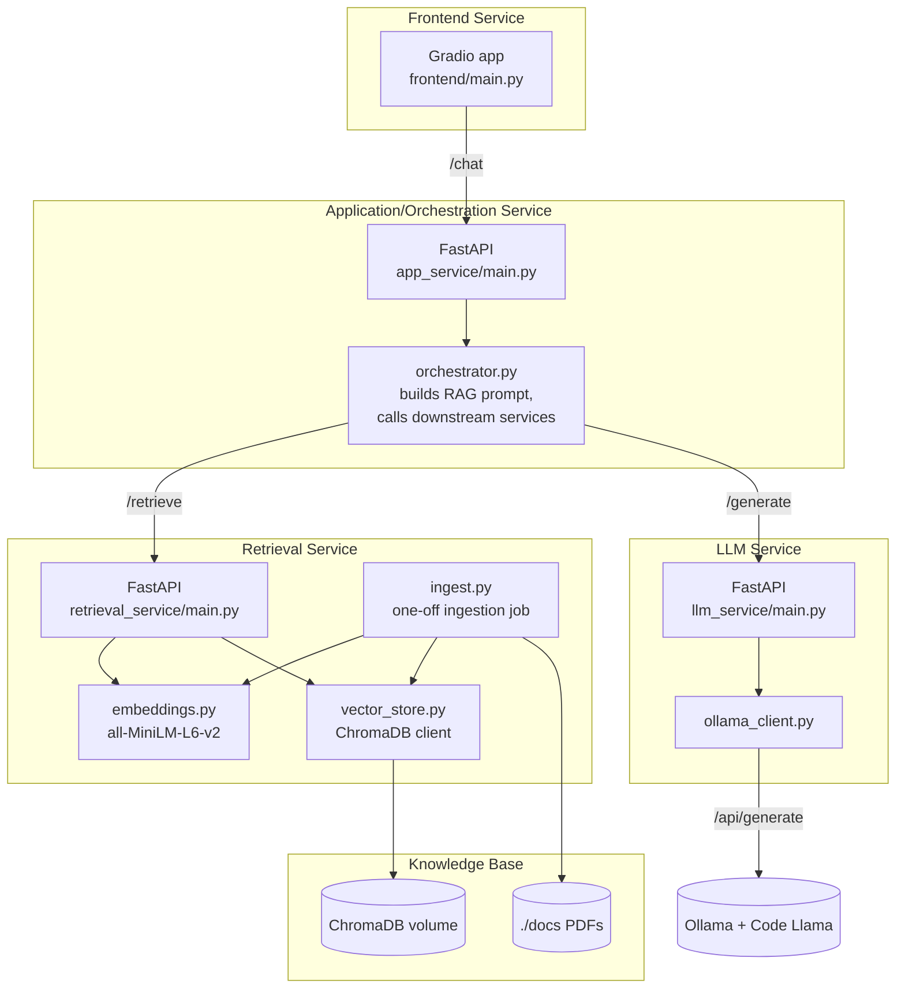
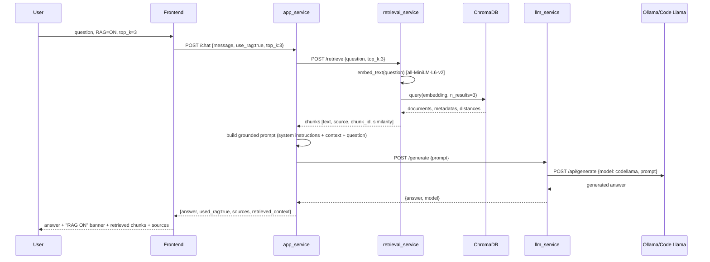
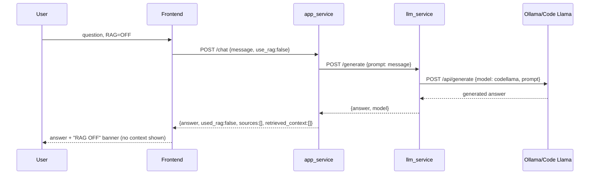
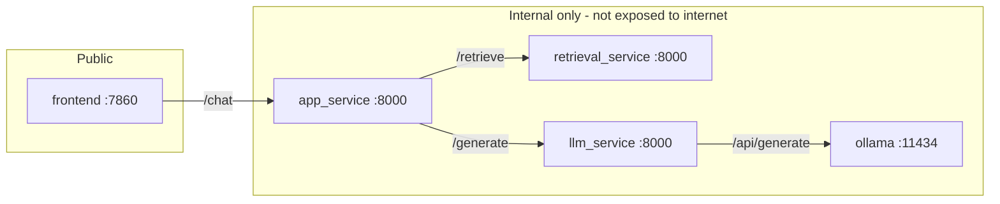
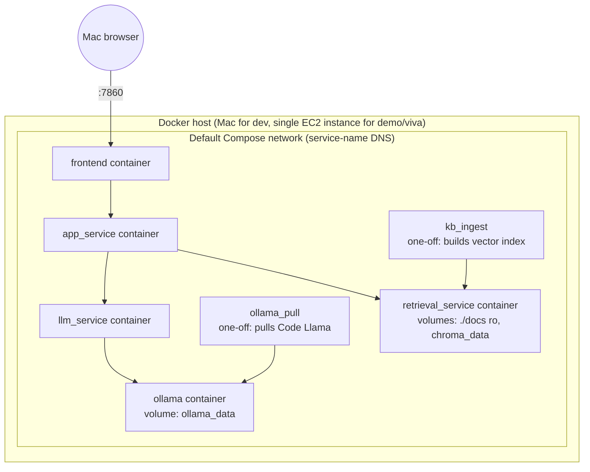
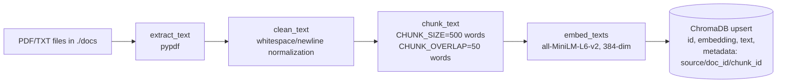

# ARCHITECTURE.md

## High-level architecture



## Component / service diagram



## RAG flow (use_rag = true)



## Non-RAG flow (use_rag = false)



## API flow (summary)



## Docker architecture



Key rule enforced throughout: containers address each other by **Compose service name**
(`http://llm_service:8000`), never `localhost` — `localhost` inside a container means
"this container," which was the root cause of the original `app_service` bug (see
[PROJECT_AUDIT.md](PROJECT_AUDIT.md) §13/§16).

## AWS architecture

```mermaid
flowchart TB
    subgraph Mac
        Browser
    end
    subgraph "AWS EC2 (t3.xlarge, single instance)"
        direction TB
        SG[Security Group\ninbound: 22 SSH, 7860 Gradio\n(8000/11434 stay internal)]
        subgraph Docker on EC2
            fe[frontend :7860]
            app[app_service]
            retr[retrieval_service]
            llm[llm_service]
            ollama[ollama + Code Llama]
        end
        EBS[(30GB gp3 EBS\nmodel weights + chroma index)]
    end
    Browser -->|https/http :7860| SG --> fe
    fe --> app --> retr
    app --> llm --> ollama
    ollama --- EBS
    retr --- EBS
```

Rationale for one instance rather than ECS/ECR/App-Runner: it is the cheapest and easiest
architecture for a student to explain end-to-end in a viva, while still satisfying "the
LLM runs in the cloud, not on my Mac." See README.md §15 for sizing and cost details, and
PROJECT_AUDIT.md §19/§20 for the risk tradeoffs considered.

## Data flow (ingestion)



## Request lifecycle (end to end, RAG on)

1. Gradio frontend collects `message`, `use_rag`, `top_k` and POSTs to `app_service /chat`.
2. `app_service` validates the request (Pydantic), logs it, and — because `use_rag=true`
   — calls `retrieval_service /retrieve`.
3. `retrieval_service` embeds the question, runs a ChromaDB similarity search, converts
   L2 distance to a 0-1 similarity score, and returns chunks with `source`/`chunk_id`.
4. `app_service` builds a system+context+question prompt instructing the model to answer
   only from context and say so explicitly if the answer isn't present.
5. `app_service` calls `llm_service /generate`, which forwards to Ollama's
   `/api/generate` with the `codellama:7b-instruct-q4_K_M` model tag.
6. The generated answer flows back through `llm_service` → `app_service` → the frontend,
   which renders the answer, the RAG-ON banner, the retrieved chunks (with similarity
   scores), and the source document list.
